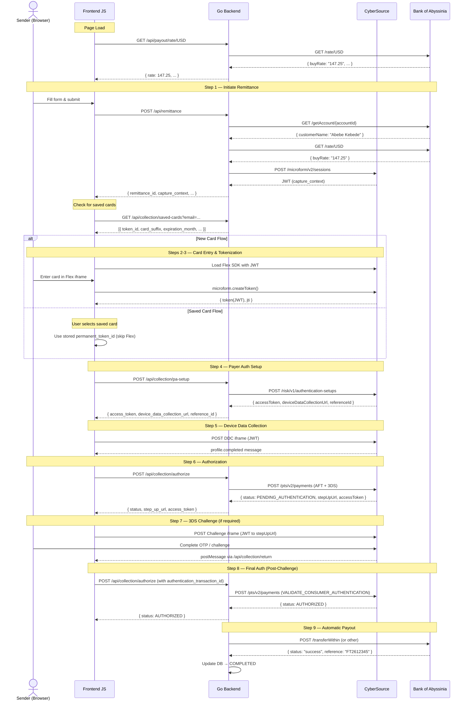
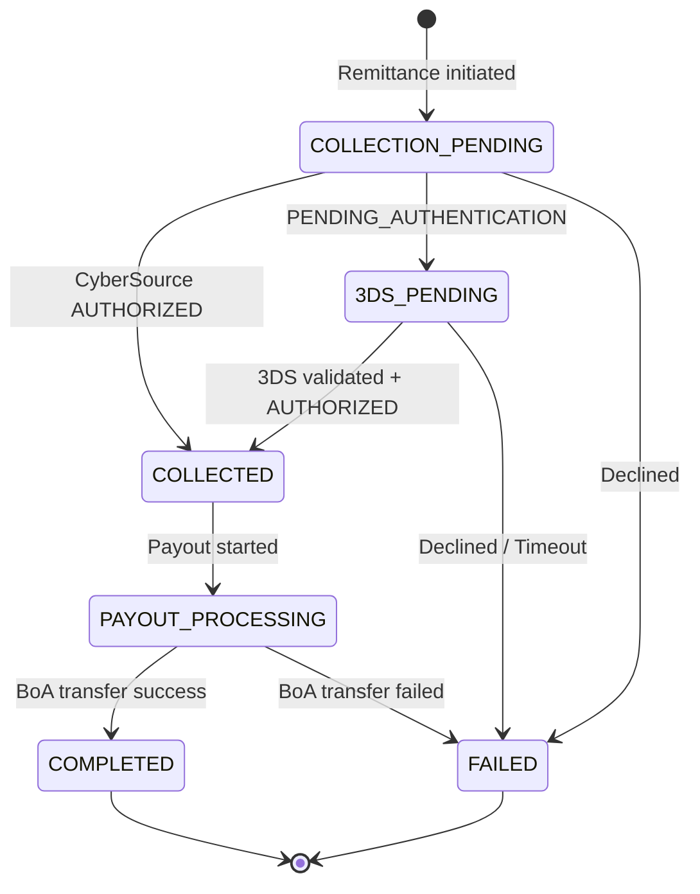

# GlobalRemit — Remittance Service

A production-grade remittance service that combines **CyberSource REST API** for inbound payment collection (international cards) with **Bank of Abyssinia (BoA)** for outbound payout disbursement (ETB) to Ethiopian recipients.

**Version:** 2.0  
**Architecture:** Go (Echo) Backend · CyberSource Flex Microform · 3DS 2.x · Card-on-File · Bank of Abyssinia API

---

## Table of Contents

1. [System Overview](#system-overview)
2. [Architecture](#architecture)
3. [End-to-End Flow](#end-to-end-flow)
4. [Detailed Step-by-Step Flow](#detailed-step-by-step-flow)
   - [Step 1: Initiate Remittance](#step-1-initiate-remittance)
   - [Step 2: Flex Microform — Capture Context](#step-2-flex-microform--capture-context)
   - [Step 3: Card Tokenization (Frontend ↔ CyberSource)](#step-3-card-tokenization-frontend--cybersource)
   - [Step 4: Payer Authentication Setup (PA Setup)](#step-4-payer-authentication-setup-pa-setup)
   - [Step 5: Device Data Collection (DDC)](#step-5-device-data-collection-ddc)
   - [Step 6: Authorization with 3DS Enrollment](#step-6-authorization-with-3ds-enrollment)
   - [Step 7: 3DS Challenge (Conditional)](#step-7-3ds-challenge-conditional)
   - [Step 8: Final Authorization (Post-Challenge)](#step-8-final-authorization-post-challenge)
   - [Step 9: Automatic Payout via Bank of Abyssinia](#step-9-automatic-payout-via-bank-of-abyssinia)
5. [Saved Cards (Card-on-File)](#saved-cards-card-on-file)
6. [Payout Types & BoA API Details](#payout-types--boa-api-details)
7. [Status Lifecycle](#status-lifecycle)
8. [API Routes Summary](#api-routes-summary)
9. [Getting Started](#getting-started)
10. [Testing](#testing)
11. [Project Structure](#project-structure)
12. [Security](#security)

---

## System Overview

GlobalRemit is a remittance service that enables international money transfers to Ethiopia. The service has two core legs:

| Leg | Provider | Purpose |
|-----|----------|---------|
| **Inbound Collection** | CyberSource (Visa) | Collect funds from sender via credit/debit card using Flex Microform + 3DS 2.x |
| **Outbound Payout** | Bank of Abyssinia (BoA) | Disburse funds to recipient via bank account or mobile wallet |

**Supported Payout Types:**

| Type | Description | BoA API Endpoint |
|------|-------------|------------------|
| `WITHIN_BOA` | Transfer to a BoA account | `/transferWithin` |
| `OTHER_BANK` | Transfer to another Ethiopian bank (via EthSwitch) | `/otherBank/transferEthswitch` |
| `TELEBIRR` | Transfer to Telebirr mobile wallet | `/moneySend` |
| `MPESA` | Transfer to M-Pesa mobile wallet | `/moneySend` |

**Supported Source Currencies:** USD, EUR, GBP, CAD, AUD  
**Target Currency:** ETB (Ethiopian Birr)

---

## Architecture

```
┌─────────────────────┐                     ┌──────────────────────┐
│   Sender (Intl)     │                     │  Receiver (Ethiopia) │
│  (Flex Microform /  │                     │  Bank/Wallet Account │
│   Saved Card)       │                     └──────────▲───────────┘
└────────┬────────────┘                                │
         │                                        ⑥ Disbursement
    ① Initiate                                     (ETB)
    Remittance                                         │
         │                                             │
┌────────▼─────────────────────────────────────────────┤───────────┐
│                 REMITTANCE SERVICE                    │           │
│                                                      │           │
│  ┌────────────────────┐    ┌─────────────────────────┤──┐        │
│  │  Collection         │    │  Payout Service          │  │        │
│  │  Service (REST)     │    │                          │  │        │
│  │                     │    │  • Validate Beneficiary   │  │        │
│  │  ② Tokenize (new)   │    │  ⑤ Transfer Within BoA   │  │        │
│  │    or Select Saved  │    │    Transfer Other Bank    │  │        │
│  │  ③ 3DS Auth         │    │    Transfer Wallet        │  │        │
│  │  ④ Authorize (AFT)  │    │                          │  │        │
│  │  • Card-on-File     │    │                          │  │        │
│  └────────┬────────────┘    └──────────▲───────────────┘  │        │
│           │                            │                   │        │
│      Result State               On SUCCESS                │        │
│      Machine                    trigger payout             │        │
└────────────────────────────────────────────────────────────┘        │
         │                                             │
    CyberSource                                  Bank of
    REST API                                    Abyssinia
                                                 API
```

### Key Features

* **PCI-DSS SAQ A Compliance**: Sensitive card data is tokenized via **Flex Microform** iframes; card details never touch your server.
* **AFT (Account Funding Transaction)**: Fully compliant with international remittance regulations, sending mandatory sender/recipient data to card schemes.
* **3DS 2.x Integration**: Native orchestration of Device Data Collection (DDC) and Identity Verification (Challenge) flows.
* **Card-on-File (Saved Cards)**: Returning senders can select a previously used card to skip the Flex Microform tokenization step entirely. Tokens are stored as CyberSource `InstrumentIdentifier`s.
* **Unified Authorize Endpoint**: A single `/api/collection/authorize` handles both initial authorization and post-3DS-challenge validation (based on the presence of `authentication_transaction_id`).
* **Cross-Origin 3DS Return**: The 3DS challenge return handler uses `postMessage` to safely bypass CORS restrictions between different origins (e.g., `localhost` vs. `devtunnels`).
* **Multi-Payout Options**: Real-time disbursement via BoA internal transfer, EthSwitch (other banks), or Mobile Wallets (Telebirr/M-Pesa).

---

## End-to-End Flow



---

## Detailed Step-by-Step Flow

### Step 1: Initiate Remittance

> **Frontend → Backend** — The user fills out the remittance form and clicks "Continue to Payment."

#### Request: `POST /api/remittance`

```json
{
  "sender_name": "John Smith",
  "sender_email": "john@example.com",
  "sender_address": "123 Main St",
  "sender_city": "New York",
  "sender_state": "NY",
  "sender_postal": "10001",
  "sender_country": "United States",
  "receiver_name": "Abebe Kebede",
  "receiver_address": "Bole Road 45",
  "receiver_city": "Addis Ababa",
  "receiver_country": "Ethiopia",
  "receiver_phone": "",
  "send_amount": "100.00",
  "send_currency": "USD",
  "target_currency": "ETB",
  "payout_type": "WITHIN_BOA",
  "account_number": "1000123456789",
  "bank_id": ""
}
```

**What the backend does internally:**

1. **Validates** the request fields (amount, currency, payout_type, sender/receiver info)
2. **Validates the beneficiary** via BoA API:
   - For `WITHIN_BOA`: `GET /getAccount/{accountId}`
   - For `OTHER_BANK`: `GET /otherBank/getAccount/{bankID}/{accountID}`
   - For `TELEBIRR`: `GET /getName/telebirr/{phone}`
   - For `MPESA`: `GET /getName/mpesa/{phone}`
3. **Fetches exchange rate** via BoA: `GET /rate/USD`
4. **Generates CyberSource Capture Context** via: `POST /microform/v2/sessions`
5. **Saves the remittance** to PostgreSQL with status `COLLECTION_PENDING`

#### Response: `200 OK`

```json
{
  "remittance_id": "a1b2c3d4-e5f6-7890-abcd-ef1234567890",
  "status": "COLLECTION_PENDING",
  "send_amount": "100.00",
  "send_currency": "USD",
  "exchange_rate": 147.25,
  "receive_amount": "14725.00",
  "capture_context": "eyJraWQiOiIwNG51M2...",
  "message": "Remittance initiated. Beneficiary: Abebe Kebede. Proceed to payment.",
  "created_at": "2026-06-16T12:00:00Z"
}
```

---

### Step 2: Flex Microform — Capture Context

> **Frontend ↔ CyberSource** — The frontend loads the CyberSource Flex SDK using the capture context JWT. This creates secure hosted iframes for the card number and CVV fields.

> **Note:** This step is **skipped entirely** when the user selects a **Saved Card**. The frontend uses the stored `permanent_token_id` instead.

```javascript
// Frontend loads the Flex SDK
const FLEX_SDK_URL = 'https://flex.cybersource.com/cybersource/assets/microform/0.11/flex-microform.min.js';

// Initialize with the capture context JWT from Step 1
flexInstance = new Flex(captureContext);
microform = flexInstance.microform();

// Create secure hosted fields (iframes)
const cardNumber = microform.createField('number', { placeholder: '•••• •••• •••• ••••' });
const securityCode = microform.createField('securityCode', { placeholder: '•••' });

cardNumber.load('#card-number-container');
securityCode.load('#security-code-container');
```

> **Important:** Card number and CVV are entered inside CyberSource-hosted iframes. The actual card data **never touches** your server — this is the PCI DSS compliance mechanism.

---

### Step 3: Card Tokenization (Frontend ↔ CyberSource)

> **Frontend → CyberSource (Direct)** — When the user clicks "Authorize Payment," the Flex SDK tokenizes the card directly with CyberSource.

> **Note:** This step is **skipped** when the user selects a **Saved Card**.

```javascript
const options = {
    expirationMonth: "12",
    expirationYear: "2028"
};

microform.createToken(options, (err, tokenResponse) => {
    // tokenResponse contains:
    // - token: JWT string (the transient token)
    // - jti: unique token identifier
});
```

**CyberSource returns to the frontend (via callback):**

```json
{
  "token": "eyJhbGciOiJSUzI1NiIsInR5cCI6IkpXVCJ9...",
  "jti": "1D1E2F3A-4B5C-6D7E-8F9A-0B1C2D3E4F5G"
}
```

> This is a **transient token** — a short-lived reference to the card data stored securely at CyberSource. It replaces the raw card number in all subsequent API calls.

---

### Step 4: Payer Authentication Setup (PA Setup)

> **Frontend → Backend → CyberSource** — Initiate 3DS 2.x authentication setup.

#### Request: `POST /api/collection/pa-setup`

**New Card:**

```json
{
  "remittance_id": "a1b2c3d4-e5f6-7890-abcd-ef1234567890",
  "transient_token_jti": "1D1E2F3A-4B5C-6D7E-8F9A-0B1C2D3E4F5G",
  "transient_token_jwt": "eyJhbGciOiJSUzI1NiIs...",
  "expiration_month": "12",
  "expiration_year": "2028"
}
```

**Saved Card:**

```json
{
  "remittance_id": "a1b2c3d4-e5f6-7890-abcd-ef1234567890",
  "permanent_token_id": "7033260002211241000",
  "expiration_month": "12",
  "expiration_year": "2030"
}
```

**Backend → CyberSource (New Card):**

```json
{
  "clientReferenceInformation": {
    "code": "a1b2c3d4-e5f6-7890-abcd-ef1234567890"
  },
  "tokenInformation": {
    "transientToken": "1D1E2F3A-...",
    "transientTokenJwt": "eyJhbGciOi..."
  },
  "paymentInformation": {
    "card": {
      "expirationMonth": "12",
      "expirationYear": "2028"
    }
  }
}
```

**Backend → CyberSource (Saved Card):**

```json
{
  "clientReferenceInformation": {
    "code": "a1b2c3d4-e5f6-7890-abcd-ef1234567890"
  },
  "paymentInformation": {
    "instrumentIdentifier": {
      "id": "7033260002211241000"
    },
    "card": {
      "expirationMonth": "12",
      "expirationYear": "2030"
    }
  }
}
```

#### Response: `200 OK`

```json
{
  "access_token": "eyJhbGciOiJIUzI1NiIs...",
  "device_data_collection_url": "https://centinelapistag.cardinalcommerce.com/V2/Cruise/Collect",
  "reference_id": "a1b2c3d4-e5f6-7890-abcd-000000000001"
}
```

---

### Step 5: Device Data Collection (DDC)

> **Frontend → CyberSource (Cardinal) Direct** — A hidden iframe posts the DDC JWT to CyberSource's Cardinal Commerce service for device fingerprinting.

```javascript
const container = document.getElementById('ddc-container');
container.innerHTML = `
    <form id="ddc-form" method="POST"
          action="${deviceDataCollectionUrl}"
          target="ddc-iframe">
        <input type="hidden" name="JWT" value="${accessToken}">
    </form>
    <iframe name="ddc-iframe" style="display:none;"></iframe>
`;
document.getElementById('ddc-form').submit();

// Listen for completion
window.addEventListener('message', (event) => {
    const data = JSON.parse(event.data);
    if (data.MessageType === 'profile.completed') {
        console.log('DDC Profiling completed');
        // Proceed to Step 6
    }
});
```

---

### Step 6: Authorization with 3DS Enrollment

> **Frontend → Backend → CyberSource** — The main authorization call. This simultaneously:
> - Initiates the card payment (AFT — Account Funding Transaction)
> - Checks 3DS enrollment (`CONSUMER_AUTHENTICATION` action)
> - Creates a permanent token (`TOKEN_CREATE` action) for new cards

#### Request: `POST /api/collection/authorize`

**New Card:**

```json
{
  "remittance_id": "a1b2c3d4-e5f6-7890-abcd-ef1234567890",
  "transient_token_jti": "1D1E2F3A-...",
  "transient_token_jwt": "eyJhbGciOi...",
  "pa_reference_id": "a1b2c3d4-e5f6-7890-abcd-000000000001",
  "expiration_month": "12",
  "expiration_year": "2028",
  "amount": "100.00",
  "currency": "USD",
  "sender": {
    "first_name": "John",
    "last_name": "Smith",
    "email": "john@example.com",
    "address": "123 Main St",
    "city": "New York",
    "administrative_area": "NY",
    "country": "United States",
    "postal_code": "10001"
  },
  "recipient": {
    "first_name": "Abebe",
    "last_name": "Kebede",
    "address": "Bole Road 45",
    "city": "Addis Ababa",
    "country": "Ethiopia"
  }
}
```

**Saved Card:**

```json
{
  "remittance_id": "a1b2c3d4-e5f6-7890-abcd-ef1234567890",
  "permanent_token_id": "7033260002211241000",
  "pa_reference_id": "a1b2c3d4-e5f6-7890-abcd-000000000001",
  "expiration_month": "12",
  "expiration_year": "2030",
  "amount": "100.00",
  "currency": "USD",
  "sender": { "..." },
  "recipient": { "..." }
}
```

**Backend → CyberSource (New Card):**

The `actionList` includes `["AUTHORIZATION", "CONSUMER_AUTHENTICATION", "TOKEN_CREATE"]`.
Payment information uses `tokenInformation.transientTokenJwt`.

**Backend → CyberSource (Saved Card):**

The `actionList` includes `["AUTHORIZATION", "CONSUMER_AUTHENTICATION"]` (no `TOKEN_CREATE`).
Payment information uses `paymentInformation.instrumentIdentifier.id` with `initiator.storedCredentialUsed: true`.

#### Response — Scenario A: Direct Authorization (No Challenge)

```json
{
  "status": "AUTHORIZED",
  "remittance_id": "a1b2c3d4-e5f6-7890-abcd-ef1234567890",
  "payment_token_id": "7033260002211241000"
}
```

→ Frontend redirects to `/checkout/success?ref=a1b2c3d4-...`  
→ Backend saves the card token to `sender_cards` table for future use.

#### Response — Scenario B: 3DS Challenge Required

```json
{
  "status": "PENDING_AUTHENTICATION",
  "remittance_id": "a1b2c3d4-e5f6-7890-abcd-ef1234567890",
  "step_up_url": "https://centinelapistag.cardinalcommerce.com/V2/Cruise/StepUp",
  "access_token": "eyJhbGciOiJIUzI1NiJ9...",
  "authentication_transaction_id": "MDB5ODc2YTktMTJiYi00YjYx..."
}
```

→ Frontend proceeds to Step 7 (3DS Challenge)

---

### Step 7: 3DS Challenge (Conditional)

> **Frontend → CyberSource (Cardinal) Direct** — The frontend opens a challenge iframe where the cardholder completes the bank's authentication (e.g., OTP, biometric).

```javascript
challengeContainer.innerHTML = `
    <form id="challenge-form" method="POST"
          action="${stepUpUrl}"
          target="challenge-iframe">
        <input type="hidden" name="JWT" value="${accessToken}">
    </form>
    <iframe name="challenge-iframe" width="100%" height="400"></iframe>
`;
document.getElementById('challenge-form').submit();
```

**What happens in the iframe:**
1. The issuing bank's 3DS challenge UI loads (OTP input, biometric, etc.)
2. The cardholder completes the challenge
3. Cardinal redirects the iframe to the backend's return URL (`/api/collection/return`)
4. The return page executes `window.parent.postMessage({ type: 'challenge_complete' }, '*')` to securely notify the parent window across origins
5. The frontend's `message` event listener catches this and proceeds to Step 8

**3DS Return Handler (Backend):**

```go
api.POST("/collection/return", func(c echo.Context) error {
    return c.HTML(http.StatusOK, `
        <script>
            // Try direct function call (same origin)
            try {
                window.parent.onchallengecomplete();
            } catch(e) {}
            // Use postMessage to bypass CORS (cross-origin)
            window.parent.postMessage({ type: 'challenge_complete' }, '*');
            window.top.postMessage({ type: 'challenge_complete' }, '*');
        </script>
    `)
})
```

> **Design Note:** CyberSource's Cardinal Commerce often nests its challenge UI inside multiple iframes. `postMessage` is used instead of direct `window.parent` function calls because the `return_url` origin (e.g., `devtunnels.ms`) may differ from the main page origin (`localhost`), causing CORS blocks on direct access.

---

### Step 8: Final Authorization (Post-Challenge)

> **Frontend → Backend → CyberSource** — After the cardholder completes the 3DS challenge, the frontend re-submits the **exact same authorization payload** from Step 6, but with `authentication_transaction_id` appended. The backend detects this field and automatically switches the action to `VALIDATE_CONSUMER_AUTHENTICATION`.

#### Request: `POST /api/collection/authorize`

```json
{
  "remittance_id": "a1b2c3d4-e5f6-7890-abcd-ef1234567890",
  "authentication_transaction_id": "MDB5ODc2YTktMTJiYi00YjYx...",
  "transient_token_jti": "...",
  "transient_token_jwt": "...",
  "amount": "100.00",
  "currency": "USD",
  "sender": { "..." },
  "recipient": { "..." }
}
```

**Backend Logic (Unified Authorize Endpoint):**

```go
func (s *collectionService) AuthorizePayment(req *domain.AuthorizeRequest) {
    actionList := []string{ActionAuthorize, ActionConsumerAuth}

    // If authentication_transaction_id is present → post-challenge validation
    if req.AuthenticationTransactionId != "" {
        actionList = []string{ActionAuthorize, ActionValidateConsumerAuth}
    }

    paReq := s.buildPaymentRequest(req, actionList)
    // ... send to CyberSource
}
```

> **Why not a separate `/validate` endpoint?** The old approach sent only `remittance_id` and `authentication_transaction_id` to a stripped-down `/validate` endpoint, which failed with `MISSING_FIELD` errors because CyberSource requires the full amount and payment details even during validation. By reusing `/authorize` with the complete payload, we avoid data loss.

**Backend → CyberSource:**

```json
{
  "clientReferenceInformation": { "code": "a1b2c3d4-..." },
  "processingInformation": {
    "capture": true,
    "actionList": ["AUTHORIZATION", "VALIDATE_CONSUMER_AUTHENTICATION"]
  },
  "consumerAuthenticationInformation": {
    "authenticationTransactionId": "MDB5ODc2YTktMTJiYi00YjYx..."
  },
  "orderInformation": { "..." },
  "paymentInformation": { "..." },
  "senderInformation": { "..." },
  "recipientInformation": { "..." }
}
```

#### Response: `200 OK`

```json
{
  "status": "AUTHORIZED",
  "remittance_id": "a1b2c3d4-e5f6-7890-abcd-ef1234567890"
}
```

→ Frontend redirects to `/checkout/success?ref=a1b2c3d4-...`  
→ Backend updates DB status to `COLLECTED` and triggers automatic payout

---

### Step 9: Automatic Payout via Bank of Abyssinia

> **Backend → BoA** — Immediately after the collection is confirmed, the backend automatically triggers the payout in a background goroutine.

The payout type determines which BoA endpoint is called:

#### Payout Type: `WITHIN_BOA`

```json
// POST https://api.bankofabyssinia.com/transferWithin
{
  "client_id": "<boa_client_id>",
  "amount": "14725.00",
  "accountNumber": "1000123456789",
  "reference": "a1b2c3d4-e5f6-7"
}
```

#### Payout Type: `OTHER_BANK`

```json
// POST https://api.bankofabyssinia.com/otherBank/transferEthswitch
{
  "client_id": "<boa_client_id>",
  "amount": "14725.00",
  "bankCode": "CBET",
  "accountNumber": "1000987654321",
  "receiverName": "Abebe Kebede",
  "reference": "a1b2c3d4-e5f6-7"
}
```

#### Payout Type: `TELEBIRR` or `MPESA`

```json
// POST https://api.bankofabyssinia.com/moneySend
{
  "client_id": "<boa_client_id>",
  "amount": "14725.00",
  "remitterName": "John Smith",
  "receiverName": "Abebe Kebede",
  "receiverPhonenumber": "251912345678",
  "reference": "a1b2c3d4-e5f6-7"
}
```

---

## Saved Cards (Card-on-File)

Returning senders can skip the card entry process entirely by selecting a previously saved card.

### How It Works

1. **Card Saving:** When a new card is successfully authorized, CyberSource returns an `InstrumentIdentifier` (permanent token). The backend saves this token along with card metadata (BIN, last 4 digits, brand, expiration) to the `sender_cards` table.

2. **Card Retrieval:** When a returning sender initiates a new remittance, the frontend calls `GET /api/collection/saved-cards?email=...` and displays a radio-button selection UI.

3. **Card Selection:** When the sender selects a saved card, the frontend skips Flex Microform entirely and sends `permanent_token_id` instead of transient tokens.

4. **Backend Handling:** When `permanent_token_id` is present:
   - PA-Setup uses `paymentInformation.instrumentIdentifier` instead of `tokenInformation`
   - Authorization uses `paymentInformation.instrumentIdentifier` with `initiator.storedCredentialUsed: true`
   - `TOKEN_CREATE` action is omitted from the action list

### `sender_cards` Table Schema

| Column | Type | Description |
|--------|------|-------------|
| `id` | UUID | Primary key |
| `sender_email` | TEXT | Sender's email address |
| `token_id` | TEXT | CyberSource InstrumentIdentifier ID |
| `card_bin` | TEXT | First 6 digits of card number |
| `card_suffix` | TEXT | Last 4 digits of card number |
| `card_brand` | TEXT | Card brand (e.g., "001" = Visa) |
| `expiration_month` | TEXT | Card expiration month |
| `expiration_year` | TEXT | Card expiration year |
| `created_at` | TIMESTAMP | When the card was saved |

### PCI Compliance

> **No raw card data is stored.** Only the CyberSource-issued `InstrumentIdentifier` token and non-sensitive metadata (BIN prefix, last 4 digits, expiry) are persisted locally. The actual card number and CVV are never seen by the backend.

---

## Payout Types & BoA API Details

### BoA Authentication (OAuth 2.0)

All BoA API calls require a valid OAuth 2.0 access token obtained via the refresh token grant.

```json
// POST https://api.bankofabyssinia.com/token
{
  "client_id": "<client_id>",
  "client_secret": "<client_secret>",
  "refresh_token": "<refresh_token>",
  "grant_type": "refresh_token"
}
```

> **Warning:** BoA **rotates the refresh token** on every use. The new refresh token is persisted to `config.yaml` automatically. If the token is lost, manual re-provisioning is required.

### Beneficiary Validation Endpoints

| Payout Type | BoA Endpoint | Method |
|-------------|--------------|--------|
| `WITHIN_BOA` | `GET /getAccount/{accountId}` | Validates BoA account |
| `OTHER_BANK` | `GET /otherBank/getAccount/{bankId}/{accountId}` | Validates inter-bank account |
| `TELEBIRR` | `GET /getName/telebirr/{phone}` | Validates Telebirr wallet |
| `MPESA` | `GET /getName/mpesa/{phone}` | Validates M-Pesa wallet |

---

## Status Lifecycle



| Status | Description |
|--------|-------------|
| `COLLECTION_PENDING` | Remittance initiated, awaiting card payment |
| `3DS_PENDING` | Card enrolled in 3DS, awaiting challenge completion |
| `COLLECTED` | Payment authorized & captured successfully |
| `PAYOUT_PROCESSING` | Outbound transfer in progress via BoA |
| `COMPLETED` | Funds disbursed to recipient |
| `FAILED` | Any step failed (card declined, BoA error, etc.) |
| `CANCELLED` | Manually cancelled |

---

## API Routes Summary

### Remittance (End-to-End)

| Method | Route | Description |
|--------|-------|-------------|
| `POST` | `/api/remittance` | Initiate remittance (validate + generate capture context) |
| `POST` | `/api/remittance/payout` | Manually trigger payout for a collected remittance |
| `GET` | `/api/remittance/status/:id` | Get remittance status by ID |
| `GET` | `/api/remittance/sender/:email` | List remittances by sender email |
| `GET` | `/api/remittance/receiver/:phone` | List remittances by receiver phone |

### Collection (CyberSource Inbound)

| Method | Route | Description |
|--------|-------|-------------|
| `POST` | `/api/collection/capture-context` | Generate Flex Microform capture context JWT |
| `POST` | `/api/collection/pa-setup` | Payer Authentication Setup (3DS 2.x) |
| `POST` | `/api/collection/authorize` | Authorize payment (also handles post-challenge validation) |
| `GET` | `/api/collection/saved-cards` | Retrieve saved cards for returning senders |
| `POST` | `/api/collection/return` | 3DS challenge return handler (HTML + postMessage) |
| `POST` | `/api/collection/review` | Approve/reject remittances pending manual review |
| `POST` | `/api/collection/webhook` | CyberSource Decision Manager webhook |

### Payout (Bank of Abyssinia Outbound)

| Method | Route | Description |
|--------|-------|-------------|
| `POST` | `/api/payout/validate` | Validate beneficiary account/wallet |
| `GET` | `/api/payout/rate/:currency` | Get exchange rate (USD, EUR, etc.) |
| `GET` | `/api/payout/banks` | List available banks for other-bank transfer |
| `GET` | `/api/payout/balance` | Get settlement account balance |
| `GET` | `/api/payout/status/:id` | Check payout remittance status at BoA |

### Static / Health

| Method | Route | Description |
|--------|-------|-------------|
| `GET` | `/` | Frontend static files |
| `GET` | `/health` | Service health check |
| `GET` | `/checkout/success` | Payment success page |
| `GET` | `/checkout/declined` | Payment declined page |
| `GET` | `/checkout/error` | Payment error page |
| `GET` | `/checkout/review` | Payment under review page |

---

## Getting Started

### Prerequisites

* Go 1.21+
* Docker & Docker-compose (for PostgreSQL)
* CyberSource REST API Credentials (Merchant ID, Key ID, Shared Secret)
* Bank of Abyssinia API Credentials (Client ID, Client Secret, Refresh Token, API Key)

### Setup

```bash
# 1. Environment and DB
docker-compose up -d

# 2. Configuration
cp config/example_config.yaml config/config.yaml
# Update config/config.yaml with your REST API keys

# 3. Start Server
go run cmd/server/main.go
```

---

## Testing

1. Visit `http://localhost:8090`.
2. Fill the remittance form and click "Continue to Payment."
3. Use card `4111 1111 1111 1111` for a frictionless (no challenge) test transaction.
4. Use card `4000 0000 0000 0002` to test the 3DS 2.x challenge flow.
5. For returning senders, complete a second transaction with the same email to test the **Saved Card** flow.

### Test Sender Profiles

| Name | Email | Address | City | State | Postal | Country |
|------|-------|---------|------|-------|--------|---------|
| Michael Chen | michael.chen.1985@gmail.com | 1600 Amphitheatre Parkway | Mountain View | CA | 94043 | United States |
| Sarah Jenkins | sarah.j.design88@example.com | 350 5th Avenue | New York | NY | 10118 | United States |

---

## Project Structure

```
remittance/
├── cmd/server/main.go            # Entrypoint & routing
├── config/                       # YAML Configuration
├── frontend/                     # Vanilla JS + CSS Client
│   ├── index.html                # Main checkout page
│   ├── checkout.js               # Payment orchestration logic
│   ├── styles.css                # Application styles
│   └── checkout/                 # Result pages (success, declined, etc.)
├── internal/
│   ├── cybersource/              # REST API Client & HMAC Signature logic
│   ├── boa/                      # Bank of Abyssinia Client (OAuth + API)
│   ├── service/                  # Business logic (Collection, Payout, Remittance)
│   ├── handler/                  # HTTP Handlers (Echo)
│   ├── database/                 # PostgreSQL queries & schema
│   └── domain/                   # Models, Interfaces, Constants
├── docker-compose.yml            # Infrastructure (PostgreSQL)
├── go.mod / go.sum               # Go module dependencies
└── README.md                     # This file
```

---

## Security

* **PCI-DSS SAQ A**: Card data (PAN, CVV) never touches the backend — handled entirely by CyberSource Flex Microform iframes.
* **Card-on-File Tokens**: Only CyberSource `InstrumentIdentifier` tokens and non-sensitive metadata are stored locally.
* **REST Signature**: All CyberSource API requests use HMAC-SHA256 HTTP Signature authentication.
* **3DS 2.x**: Strong Customer Authentication (SCA) compliance for European and high-risk transactions.
* **AFT Compliance**: `businessApplicationId: "PP"` marks all transactions as person-to-person fund transfers per Visa rules.
* **BoA Token Rotation**: OAuth refresh tokens are auto-rotated and persisted to `config.yaml`.
* **Cross-Origin Safety**: 3DS return handler uses `postMessage` with origin-aware handling instead of direct cross-frame function calls.
